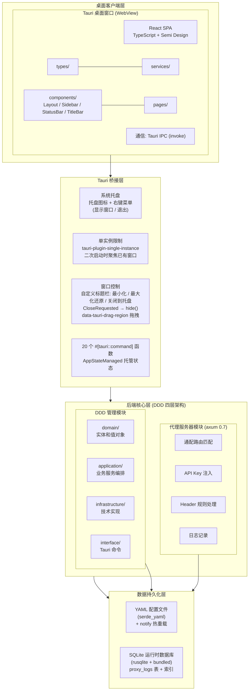
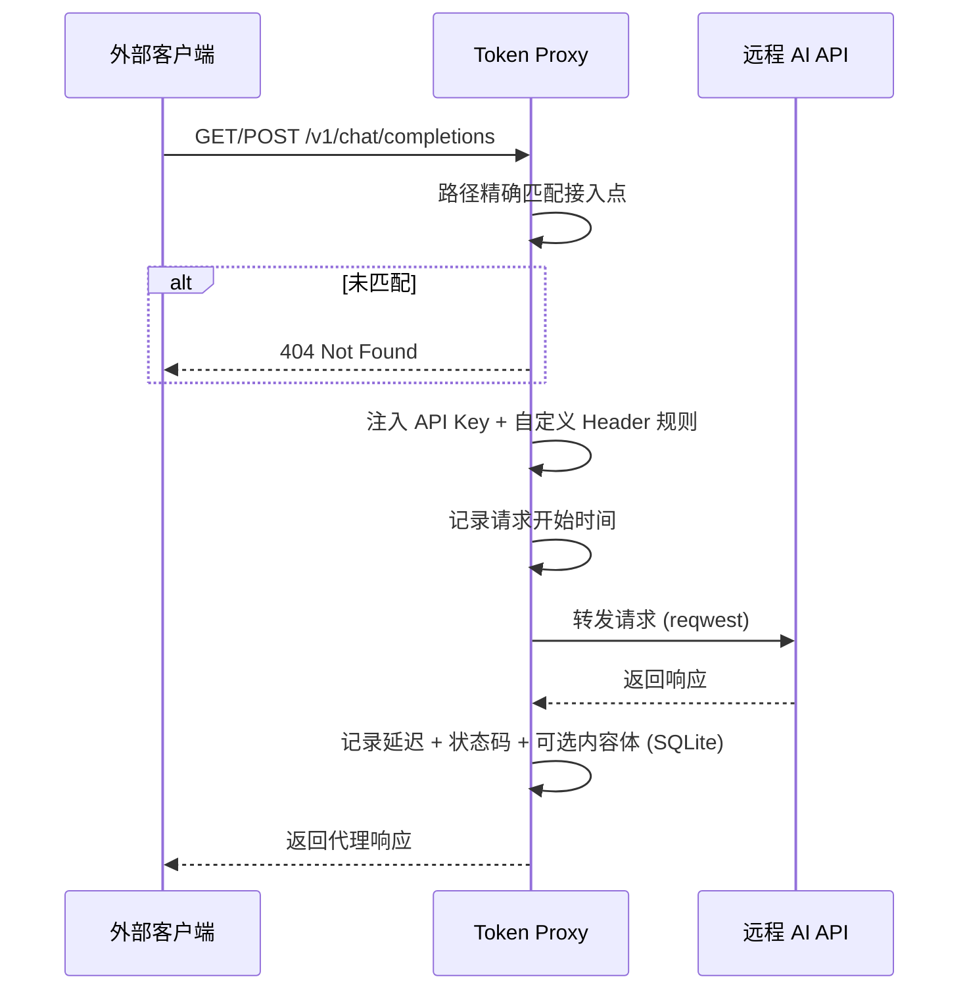
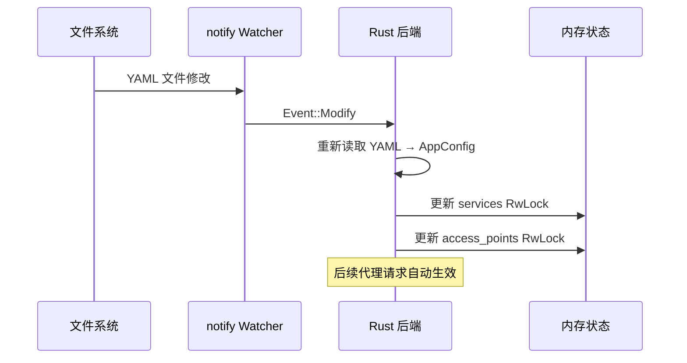
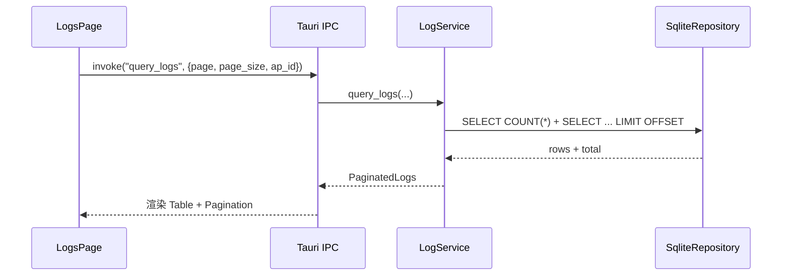

# Token Proxy 架构文档

## 概述

Token Proxy 是一个大模型 AI API 服务透明代理桌面应用。用户可通过管理后台注册第三方 AI API 服务 (如 OpenAI、Anthropic 等)，创建本地路径映射接入点，将客户端请求透明转发到远程 AI API，并记录请求日志。

## 架构总览

### 系统分层架构图



### 技术栈

| 层级 | 技术 | 版本 | 用途 |
|------|------|------|------|
| 桌面框架 | Tauri | 2 | 跨平台桌面窗口 |
| 后端语言 | Rust | 2021 edition | 核心代理 + 管理逻辑 |
| HTTP 代理 | axum | 0.7 | 嵌入式代理服务器 |
| HTTP 客户端 | reqwest | 0.12 | 转发请求到远程 API |
| 配置持久化 | serde_yaml | 0.9 | YAML 文件读写 |
| 日志存储 | rusqlite | 0.31 | SQLite 嵌入式数据库 |
| 前端框架 | React | 19 | UI 渲染 |
| UI 组件库 | Semi Design | 2.71 | 企业级 UI 组件 |
| 路由 | React Router | 7.5 | 前端路由 |
| 构建工具 | Vite | 7 | 前端构建 |
| 文件监听 | notify | 6 | 配置热重载 |
| 日志 | tracing | 0.1 | 结构化日志 |
| 异步运行时 | tokio | 1 | 异步执行 |
| UUID | uuid | 1 | 实体 ID 生成 |
| 时间处理 | chrono | 0.4 | 时间戳 |
| 配置目录 | dirs | 5 | OS 配置路径解析 |
| CORS | tower-http | 0.5 | 跨域支持 |
| 单实例 | tauri-plugin-single-instance | 2 | 限制应用多开 |

## DDD 四层架构详解

项目后端采用领域驱动设计 (DDD) 四层架构，各层职责清晰、依赖方向由外向内。

```
src-tauri/src/
├── domain/              # 领域层 — 零依赖，纯业务概念
│   ├── api_service.rs   # API 服务实体
│   ├── access_point.rs  # 接入点实体 + 值对象
│   ├── proxy_log.rs     # 代理日志实体
│   └── app_config.rs    # 应用配置聚合根
├── application/         # 应用层 — 编排业务用例
│   ├── service_management.rs       # API 服务 CRUD
│   ├── access_point_management.rs  # 接入点 CRUD
│   ├── proxy_service.rs            # 代理服务器生命周期
│   ├── log_service.rs              # 日志查询和清理
│   └── config_service.rs           # 配置读写
├── infrastructure/      # 基础设施层 — 技术实现
│   ├── persistence/
│   │   ├── yaml_config.rs          # YAML 配置仓库
│   │   └── sqlite_repository.rs    # SQLite 日志仓库
│   └── proxy/
│       ├── proxy_server.rs         # Axum 服务器
│       ├── request_handler.rs      # 请求处理转发
│       └── logger.rs               # 日志记录
└── interface/           # 接口层 — 外部通信入口
    └── commands.rs      # 20 个 Tauri IPC 命令
```

### Domain 层

领域层是整个系统最内层，不依赖任何其他模块，只定义纯业务概念。

#### ApiService (实体)

AI API 服务的注册信息，包含唯一标识、名称、远程基础 URL 和认证密钥。

- 字段: `id`, `name`, `base_url`, `api_key`, `created_at`, `updated_at`
- 工厂方法: `ApiService::new()` — 自动生成 UUID 和时间戳

#### AccessPoint (实体)

本地路径到远程服务的映射规则定义。

- 字段: `id`, `path`, `service_id`, `header_rules`, `log_full_content`, `enabled`, `created_at`, `updated_at`
- `path`: 精确匹配的本地 URL 路径 (如 `/v1/chat/completions`)
- `service_id`: 关联的 ApiService ID
- `enabled`: 启用/禁用开关
- `log_full_content`: 是否记录完整的请求/响应体

#### HeaderRule (值对象)

自定义 HTTP Header 规则，用于在转发请求时修改 Header。

- 字段: `header_name`, `header_value`
- `action`: `Set | Override | Remove` — 定义对 Header 的操作类型

#### ProxyLog (实体)

代理请求的日志记录。

- 字段: `id`, `access_point_id`, `request_path`, `method`, `status_code`, `latency_ms`, `request_timestamp`, `request_body` (可选), `response_body` (可选), `created_at`

#### PaginatedLogs (值对象)

分页日志查询结果。

- 字段: `logs` (Vec), `total`, `page`, `page_size`

#### AppConfig (聚合根)

应用整体配置，作为 YAML 文件的顶层结构。

- 字段: `proxy_port` (默认 9876), `admin_key`, `services`, `access_points`, `log_settings`
- LogSettings: `max_log_entries` (默认 10000), `retention_days` (默认 30)

#### ProxyStatus (值对象)

代理服务器运行状态。

- 字段: `running` (bool), `port`

### Application 层

应用层编排领域对象完成业务用例，每个 Service 封装一个完整的业务能力。

#### ServiceManagement

API 服务的完整 CRUD 管理。

- `list_services` / `get_service` — 查询服务列表和详情
- `create_service` — 创建新服务，同步写入 YAML
- `update_service` — 更新服务信息，同步写入 YAML
- `delete_service` — 删除服务时级联删除关联接入点

#### AccessPointManagement

接入点的完整 CRUD 管理和状态控制。

- `list_access_points` / `get_access_point` — 查询接入点
- `create_access_point` — 创建接入点，验证 `service_id` 存在且 `path` 不重复
- `update_access_point` — 更新接入点配置
- `delete_access_point` — 删除接入点
- `toggle_access_point` — 启用/禁用切换

#### ProxyService

代理服务器 (Axum) 的生命周期管理，新增 `running: AtomicBool` 字段追踪真实运行状态。

- `start` — 在指定端口启动 Axum HTTP 服务器，启动后 `running` 置 true
- `stop` — 通过 oneshot channel 发送关闭信号，`running` 置 false
- `restart` — 停止旧服务器并在新端口启动，启动后 `running` 置 true
- `get_status` — 返回真实 `running` 值而非端口状态推断

#### LogService

请求日志的查询和清理。

- `query_logs` — 分页查询日志 (支持按接入点筛选)
- `get_log` — 查询单条日志详情
- `clear_logs` — 清空全部日志
- `cleanup_old_logs` — 按保留天数清理过期日志 (定时每 1 小时执行)

#### ConfigService

应用整体配置的管理。

- `get_config` — 读取 YAML 配置
- `update_proxy_port` — 更新代理端口
- `update_admin_key` — 更新管理密钥
- `update_log_settings` — 更新日志设置 (最大条目 + 保留天数)

### Infrastructure 层

基础设施层实现领域层定义的契约，提供技术能力支持。

#### YamlConfigRepository

使用 `serde_yaml` 实现 YAML 配置文件的读写。

- 配置路径: `dirs::config_dir()/token-proxy/config.yaml`
- 首次读取时自动创建默认配置
- `read()` — 反序列化 YAML 到 `AppConfig`
- `write()` — 序列化 `AppConfig` 到 YAML 文件

#### SqliteRepository

使用 `rusqlite` (bundled 模式) 管理 SQLite 数据库。

- 数据库文件: `token-proxy.db` (当前工作目录)
- `proxy_logs` 表: 存储代理请求日志
- 索引: `idx_logs_timestamp` (时间戳降序), `idx_logs_access_point` (接入点筛选)
- 支持: 插入 / 分页查询 / 单条查询 / 清空 / 按时间清理

#### ProxyServer

基于 Axum 0.7 的嵌入式 HTTP 代理服务器。

- 通配路由: `/ {*path}` 匹配所有请求路径
- CORS: `CorsLayer::permissive()` 允许所有跨域请求
- 优雅关闭: 通过 `tokio::sync::oneshot` channel 控制服务器生命周期
- 绑定地址: `127.0.0.1:{port}` (默认 9876)

#### request_handler

代理请求的核心处理逻辑。

1. 路径匹配: 从 `state.access_points` 中查找 `path` 完全匹配的接入点
2. 状态检查: 确认接入点处于启用状态
3. 服务关联: 通过 `service_id` 查找关联的 `ApiService`
4. URL 构建: `{service.base_url}/{path}` (自动去除尾部 `/`)
5. Header 处理: 复制原始 Header (排除 `host`)，注入 `Authorization: Bearer {api_key}`，应用自定义 Header 规则
6. 请求转发: 使用 `reqwest` 发送异步 HTTP 请求
7. 日志记录: 写入请求/响应元数据和可选内容体到 SQLite (内容超过 10000 字符时截断)

#### logger

异步日志写入函数，在请求处理完成后调用。

- 生成 UUID 作为日志 ID
- 根据 `log_full_content` 配置决定是否记录完整请求/响应体
- 内容体截断阈值: 10000 字符

### Interface 层

接口层作为外部通信入口，通过 Tauri IPC 桥接前后端。

#### AppStateManaged (托管状态)

```
AppStateManaged {
    service_mgmt: Arc<ServiceManagement>,
    access_point_mgmt: Arc<AccessPointManagement>,
    proxy_service: Arc<ProxyService>,
    log_service: Arc<LogService>,
    config_service: Arc<ConfigService>,
}
```

#### 20 个 Tauri IPC 命令

| 分组 | 命令 | 功能说明 |
|------|------|----------|
| Service 管理 | `list_services` | 查询 API 服务列表 |
| | `get_service` | 查询单个服务详情 |
| | `create_service` | 创建新 API 服务 |
| | `update_service` | 更新 API 服务信息 |
| | `delete_service` | 删除 API 服务 (级联删除关联接入点) |
| Access Point 管理 | `list_access_points` | 查询接入点列表 |
| | `get_access_point` | 查询单个接入点详情 |
| | `create_access_point` | 创建新接入点 |
| | `update_access_point` | 更新接入点配置 |
| | `delete_access_point` | 删除接入点 |
| | `toggle_access_point` | 启用/禁用接入点 |
| 日志管理 | `query_logs` | 分页查询请求日志 |
| | `get_log` | 查询单条日志详情 |
| | `clear_logs` | 清空全部日志 |
| 配置管理 | `get_config` | 读取当前配置 |
| | `update_proxy_port` | 更新代理端口并重启服务器 |
| | `update_log_settings` | 更新日志保留设置 |
| | `update_admin_key` | 更新管理密钥 |
| 代理控制 | `get_proxy_status` | 查询代理运行状态 |
| | `restart_proxy` | 重启代理服务器 |

## 前端架构

```
src/
├── main.tsx               # 入口文件，导入 Semi Design CSS
├── App.tsx                # HashRouter + 4 个页面路由
├── types/                 # TypeScript 接口 (镜像 Rust Domain)
│   ├── api-service.ts     # ApiService 接口
│   ├── access-point.ts    # AccessPoint / HeaderRule 接口
│   ├── proxy-log.ts       # ProxyLog / PaginatedLogs 接口
│   └── config.ts          # AppConfig / LogSettings / ProxyStatus 接口
├── services/              # Tauri invoke 封装层
│   ├── api-service.ts     # 5 个 Service IPC 封装
│   ├── access-point.ts    # 6 个 AccessPoint IPC 封装
│   ├── proxy-log.ts       # 3 个 Log IPC 封装
│   └── config.ts          # 6 个 Config/Proxy IPC 封装
├── components/            # 可复用组件
│   ├── TitleBar.tsx       # 自定义标题栏 (decorations: false 替代原生标题栏)
│   ├── Layout.tsx         # 布局容器 (TitleBar + Sidebar + Content + StatusBar)
│   ├── Sidebar.tsx        # 导航侧边栏 (纯菜单)
│   └── StatusBar.tsx      # 代理状态栏
└── pages/                 # 业务页面
    ├── ServicesPage.tsx   # API 服务管理页面
    ├── AccessPointsPage.tsx  # 接入点管理页面
    ├── LogsPage.tsx       # 请求日志查看页面
    └── SettingsPage.tsx   # 应用设置页面
```

路由结构 (HashRouter):

- `/` → 重定向到 `/services`
- `/services` → API 服务管理
- `/access-points` → 接入点管理
- `/logs` → 请求日志查看
- `/settings` → 应用设置

## 核心数据流

### 1. 代理转发流程



### 2. 配置管理流程

```mermaid
sequenceDiagram
    participant UI as 管理前端
    participant IPC as Tauri IPC
    participant BACKEND as Rust 后端
    participant YAML as YAML 文件

    UI->>IPC: invoke("create_service", ...)
    IPC->>BACKEND: ServiceManagement
    BACKEND->>BACKEND: 更新 Arc&lt;RwLock&lt;Vec&gt;&gt;
    BACKEND->>YAML: 读取当前配置
    BACKEND->>BACKEND: 合并 services/access_points
    BACKEND->>YAML: 写回完整配置 (保留 proxy_port/admin_key)
    BACKEND-->>UI: 返回结果
```

### 3. 配置热重载流程



### 4. 日志查询流程



## 初始化流程

应用启动时序 (`lib.rs` `run()`):

```
0. 注册基础插件 (tauri-plugin-opener)
0a. 注册单实例插件 (tauri-plugin-single-instance)，注册回调：
    二次启动时 unminimize + show + set_focus 已有窗口
1. setup 闭包: 创建托盘图标 (TrayIconBuilder)
   - 右键菜单: 显示窗口 / 退出
   - 左键点击: 显示窗口
   - 退出菜单项: 先 stop 代理服务, 再 app.exit(0)
2. setup 内异步启动:
   2.1. 解析配置目录 (dirs::config_dir/token-proxy/config.yaml)
   2.2. 初始化 YamlConfigRepository
   2.3. 读取初始 YAML 配置，提取 proxy_port
   2.4. 创建共享内存状态: Arc<RwLock<Vec<ApiService>>>
                                 Arc<RwLock<Vec<AccessPoint>>>
   2.5. 初始化 SQLite: SqliteRepository (token-proxy.db)
   2.6. 创建配置变更通知 channel (watch::channel)
   2.7. 启动 notify 文件监听器 (热重载)
   2.8. 创建应用层服务 (ServiceManagement, AccessPointManagement,
        ProxyService, LogService, ConfigService)
   2.9. 启动 Axum 代理服务器
   2.10. 启动定时日志清理任务 (每小时)
   2.11. 注册托管状态到 Tauri App
3. on_window_event: 拦截 CloseRequested → window.hide() 隐藏到托盘
4. invoke_handler 注册所有 IPC 命令
```

## 关键技术决策

### 接入点映射策略

采用**精确路径匹配**而非前缀匹配，避免路由冲突。每个接入点定义一个完整的 URL 路径 (如 `/v1/chat/completions`)，客户端请求路径需完全匹配才能转发。

### 配置数据源关系

- **YAML** 为主配置源，存储所有服务、接入点和应用设置
- **SQLite** 为运行时缓存，仅存储代理请求日志
- 配置变更通过 notify 热重载同步，无需重启应用
- 日志数据不会回写到 YAML

### 安全模型

- 桌面应用无需额外登录鉴权，依赖 OS 级别的用户隔离
- API Key 存储在 YAML 配置文件中，通过 OS 文件系统权限保护
- 管理后台有 `admin_key` 字段预留，但当前未启用鉴权校验

### 协议兼容性

代理转发不感知具体 AI API 协议，仅做 HTTP 透传，因此兼容 OpenAI-Compatible、Anthropic Messages API 等任意 HTTP API 协议。

### 前后端通信

使用 Tauri IPC (invoke) 而非 HTTP REST，这是桌面应用的原生通信方式，安全性更高、延迟更低。

### 单实例限制策略

使用 `tauri-plugin-single-instance` 官方插件实现单实例限制。二次启动时，插件回调自动将已有窗口 `unminimize` + `show` + `set_focus`，确保用户感知到正在运行的实例。此方案无需额外的 PID 文件或锁文件，与 Tauri 生命周期深度集成。

### 隐藏到托盘设计

关闭窗口时 (`CloseRequested` 事件) 不退出应用，而是调用 `window.hide()` 将窗口隐藏到系统托盘。这种设计符合桌面工具类应用的通行做法，避免误关闭导致代理中断。用户通过托盘图标右键菜单「退出」或左键点击「显示窗口」控制应用生命周期。

### 优雅退出流程

托盘「退出」菜单项的执行顺序：先调用 `ProxyService.stop()` 停止代理服务器，再调用 `app.exit(0)` 退出应用。确保退出时不会残留后台代理进程，端口及时释放。

### 自定义标题栏设计

替换 Tauri 默认原生标题栏为 React 自定义标题栏，实现统一的跨平台视觉效果。

- **配置**：`tauri.conf.json` 中设置 `"decorations": false`，禁用原生窗口装饰
- **拖拽区域**：使用 `data-tauri-drag-region` HTML 属性标记标题栏中间区域为可拖拽区域，用户可通过拖拽移动窗口位置
- **窗口控制按钮**：TitleBar 组件右侧提供三个按钮：
  - **最小化**：调用 `getCurrentWindow().minimize()` 将窗口最小化到任务栏
  - **最大化/还原**：调用 `getCurrentWindow().toggleMaximize()` 切换最大化状态，通过 `isMaximized()` + `onResized` 事件同步按钮图标
  - **关闭到托盘**：调用 `getCurrentWindow().hide()` 将窗口隐藏到系统托盘，与 Rust 端 `CloseRequested` 拦截行为一致
- **布局变更**：Layout 容器外层改为 `column` 方向，顶部插入 TitleBar，下方保留原有 `Sidebar + Content + StatusBar` 的 `row` 布局
- **Sidebar 简化**：移除 Nav 组件的 header 标题 "Token Proxy"，移入 TitleBar 左侧展示
- **权限**：Capabilities 中新增 `window.allowMinimize` / `window.allowToggleMaximize` / `window.allowIsMaximized` 三个权限
- **后端无变更**：所有标题栏逻辑在前端实现，Rust 后端不受影响

## 变更记录

| 日期 | 变更内容 | 说明 |
|------|----------|------|
| 2026-04-28 | 初始架构文档创建 | 记录 DDD 四层架构、核心数据流和关键技术决策 |
| 2026-04-29 | 补充单实例和系统托盘 | 新增单实例限制、系统托盘功能、ProxyService 状态追踪、隐藏到托盘关闭策略 |
| 2026-04-29 | 自定义标题栏 | 替换原生标题栏为 TitleBar React 组件，支持最小化/最大化还原/关闭到托盘，data-tauri-drag-region 拖拽 |
